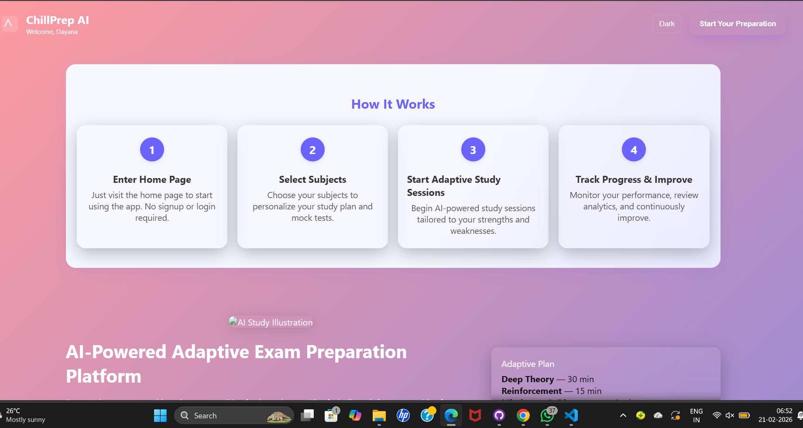
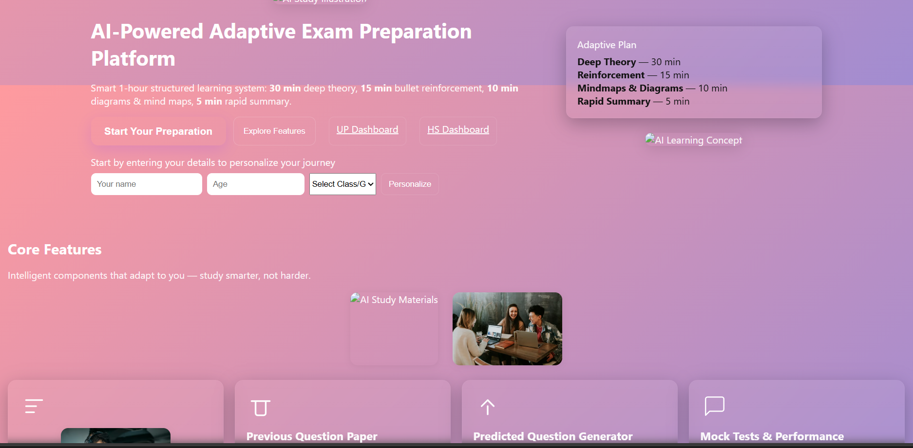
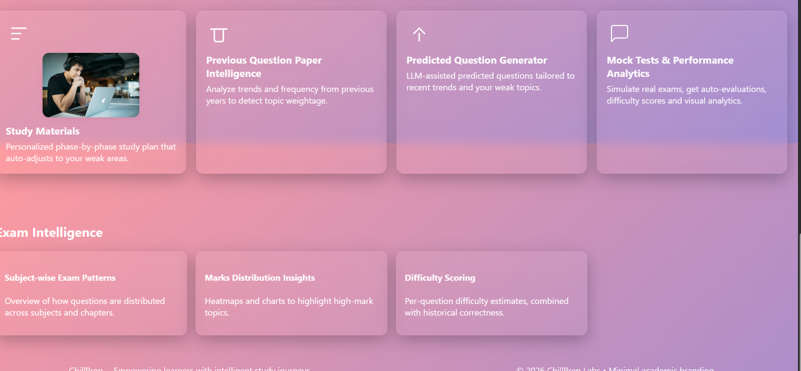

<p align="center">
	
</p>

# PanicButton App 🎯

## Basic Details

### Team Name: LogicalLooms

### Team Members
- Member 1: NANDHANA ANIL - VJCET,VAZHAKULLAM
- Member 2: HELEN V.B - VJCET,VAZHAKULLAM

### Hosted Project Link
panicbutton-app-swart.vercel.app

### Project Description
chillPrep is an AI-powered adaptive exam preparation platform that personalizes study sessions for students. It provides structured 1-hour learning modules, predicted questions, previous year analysis, AI-generated summaries, diagrams, and mind maps.

### The Problem statement
Students face:
Exam stress and panic
Lack of structured revision
Poor time management
No proper analysis of previous question trends
Overwhelming syllabus before exams
Most platforms provide content, but not adaptive intelligence.

### The Solution
ChillPrep App provides a one-click emergency alert system with AI-powered analytics, location sharing, and instant notifications to both authorities and trusted contacts, streamlining the process of getting help.

---

## Technical Details

### Technologies/Components Used

**For Software:**
- Languages used: JavaScript, HTML, CSS
- Tools used: VS Code, Git

**For Hardware:**
- Main components: N/A (Web-based project)
- Specifications: N/A
- Tools required: N/A

---

## Features

List the key features of your project:
     AI Adaptive 1-Hour Study Engine
	 Personalized Student Dashboard
	 Previous Year Question Trend Analysis
     AI Predicted Questions Generator
     Mock Test Simulator
     Performance Analytics & Weak Area Detection
     PDF Summary & Mindmap Generator
     Pink-Blue Glassmorphism UI
     Stress Reduction Guidance Mode

---

## Implementation

### For Software:

#### Installation
```bash
# No installation required, just clone and open index.html
# Or deploy to a static web host
```

#### Run
```bash
# Open index.html in your browser
```

### For Hardware:

#### Components Required
N/A

#### Circuit Setup
N/A

---

## Project Documentation

### For Software:

#### Screenshots (Add at least 3)

 <p align="center">
	
</p>
<p align="center">
	
</p>
<p align="center">
	
</p>

#### Diagrams

**System Architecture:**

Architecture Explanation:
Frontend: Next.js (App Router)
Backend API routes (Node.js)
MongoDB database
AI service integration layer
REST-based communication
Deployment via Vercel
Flow:
User → Frontend → API Routes → AI Service → Database → Response → Dashboard

**Application Workflow:**

┌─────────────┐
│   Student   │
│   (User)    │
└──────┬──────┘
       │
       ▼
┌───────────────────────┐
│   ChillPrep Frontend  │
│   (Next.js Dashboard) │
│  - Login / Dashboard  │
│  - Study Module UI    │
│  - Mock Tests         │
└──────┬────────────────┘
       │ REST API Calls
       ▼
┌──────────────────────────┐
│     Backend API Layer    │
│     (Node.js / API)      │
│  - Auth & User Logic     │
│  - Session Management   │
│  - Data Processing      │
└──────┬───────────────────┘
       │
       ├───────────────┐
       ▼               ▼
┌───────────────┐   ┌──────────────────┐
│   AI Engine   │   │    Database      │
│ (AI Services)│   │   (MongoDB)       │
│ - Question   │   │ - User Profiles  │
│   Prediction │   │ - Progress Data  │
│ - Summaries  │   │ - Test Results   │
│ - Mindmaps  │   └──────────────────┘
└──────┬────────┘
       │ AI Response
       ▼
┌──────────────────────────┐
│   Processed Insights     │
│ - Weak Areas             │
│ - Predicted Questions    │
│ - Study Recommendations  │
└──────┬───────────────────┘
       │
       ▼
┌──────────────────────────┐
│   Student Dashboard      │
│ - Personalized Study     │
│ - Performance Analytics  │
│ - Stress Reduction Mode  │
└──────────────────────────┘

---

### For Hardware:

#### Schematic & Circuit
N/A

#### Build Photos
N/A

---

## Additional Documentation

### For Web Projects with Backend:

#### API Documentation

N/A

## Project Demo

### Video
https://drive.google.com/file/d/1FVEmuGVZCCiuP_KqWKq3LMg-lsjd1z2o/view?usp=drive_link

### Additional Demos
[Add any extra demo materials/links - Live site, APK download, online demo, etc.]

---

## AI Tools Used (Optional - For Transparency Bonus)

If you used AI tools during development, document them here for transparency:

**Tool Used:** GitHub Copilot, ChatGPT

**Purpose:**
- Generated boilerplate code
- Debugging assistance
- Code review and suggestions

**Key Prompts Used:**
- "Create an emergency alert button in JavaScript"
- "Design a dashboard for real-time analytics"

**Percentage of AI-generated code:** [Approximately X%]

**Human Contributions:**
- Architecture design and planning
- Custom business logic implementation
- Integration and testing
- UI/UX design decisions

---

## Team Contributions

- [NANDHANA ANIL]: Frontend development, UI/UX design
- [HELEN V.B]: Backend integration, AI analytics

---

## License

This project is licensed under the MIT License - see the [LICENSE](LICENSE) file for details.

**Common License Options:**
- MIT License (Permissive, widely used)


---
